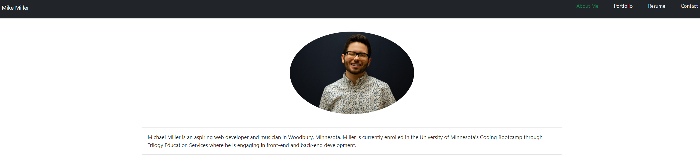

# React To Mike

## Website

https://mimi5930.github.io/react-to-mike/

## Description



React to Mike is a react-based portfolio that displays Mike's abilities in software development. Mike is excited to use this website and continue to add as his skill-set grows in the years to come.

## Local Use

to use this application locally:

1. Fork the code on [GitHub](https://github.com/mimi5930/react-to-mike) to your device.
2. Install the application's dependencies

```
npm install
```

3. Run the application to create and observe a development server on http://localhost:3001

```
npm start
```

## Contact

If you have any questions, reach out to Mike at mikej.miller440@gmail.com
